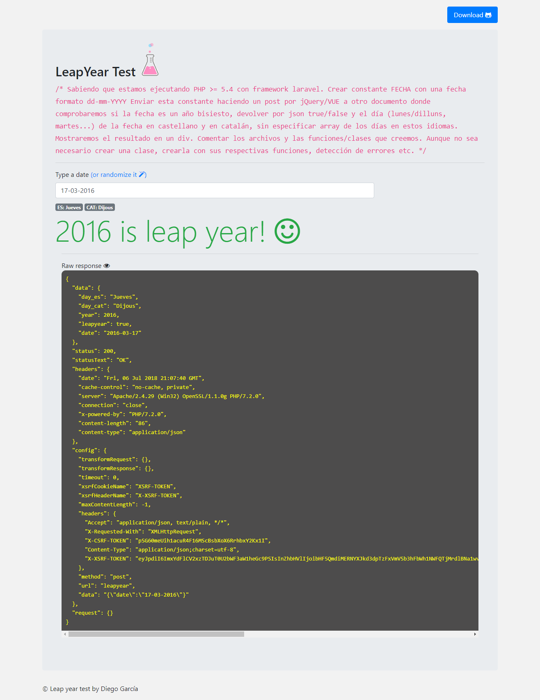

# leapyear-test

    /*
    Sabiendo que estamos ejecutando PHP >= 5.4 con framework laravel.
    Crear constante FECHA con una fecha formato dd-mm-YYYY
    
    Enviar esta constante haciendo un post por jQuery/VUE a otro documento donde comprobaremos si la fecha es un año bisiesto, devolver por json true/false y el día (lunes/dilluns, martes...)
    de la fecha en castellano y en catalán, sin especificar array de los días en estos idiomas. Mostraremos el resultado en un div.
    
    Comentar los archivos y las funciones/clases que creemos. Aunque no sea necesario crear una clase, crearla con sus respectivas funciones, detección de errores etc.
    */
    
Leap year test running on Laravel Framework 5.6.26+Vue.Js

Clone this repo to your local server / or [Download it](https://github.com/amstrad/leapyear-test/archive/master.zip)      
  ```  
     git clone https://github.com/amstrad/leapyear-test leapyear-test
   ```

move inside the new local folder and install composer dependencies:
```
    composer install
   ``` 
and node dependencies

``` npm install ```

Finish. Run project:

``` npm run watch ```

<h4>Files to watch for:</h4>

[webpack.mix.js](webpack.mix.js) 

[Sass custom styles](resources/assets/sass/app.scss) 

Frontend logic [DateForm.vue](resources/assets/js/components/DateForm.vue) 

ServerSide logic Controller Class [LeapYearController.php](app/Http/Controllers/LeapYearController.php) 

Views [home.blade.php](resources/views/home.blade.php)


 
